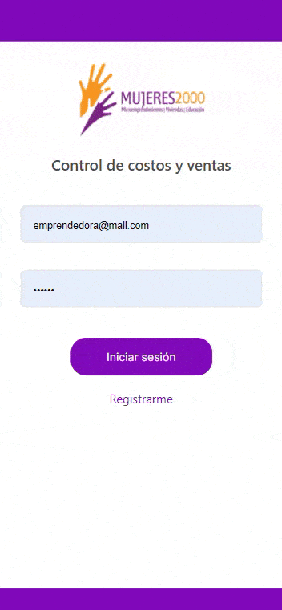

## 3 ONGs dedicadas a cuestiones de empoderamiento de la mujer presentaron distintos contextos y sus problemáticas. 
La solución aportada consiste en una aplicación de gestión financiera que permite:

*  Carga de productos.
*  Carga de Costos fijos y costos variables.
*  Carga ventas
*  Registrar ventas
*  Obtener reporte de balance
*  Descargar reportes en formato excel.

Tecnologias Utilizadas backend: Java, SpringBoot, API REST, SQL, Postman, GIT, Spring Data JPA, Hibernate, Maven, Tomcat. 

Demo del proyecto entregado: 

